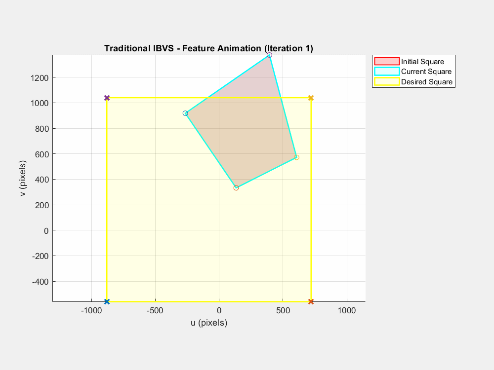
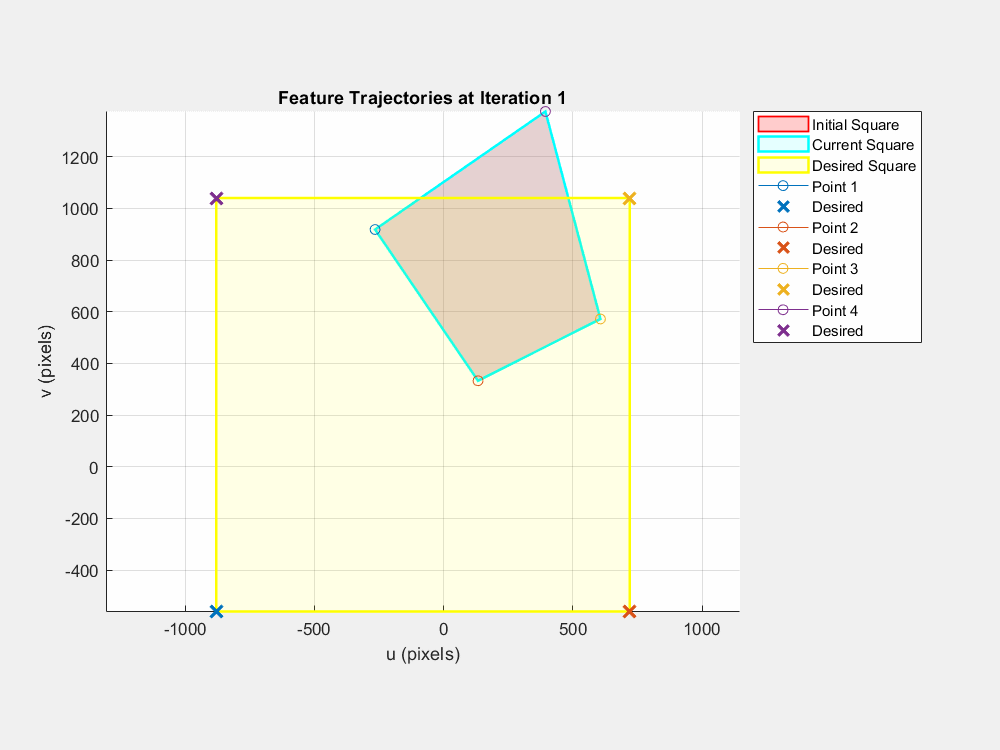
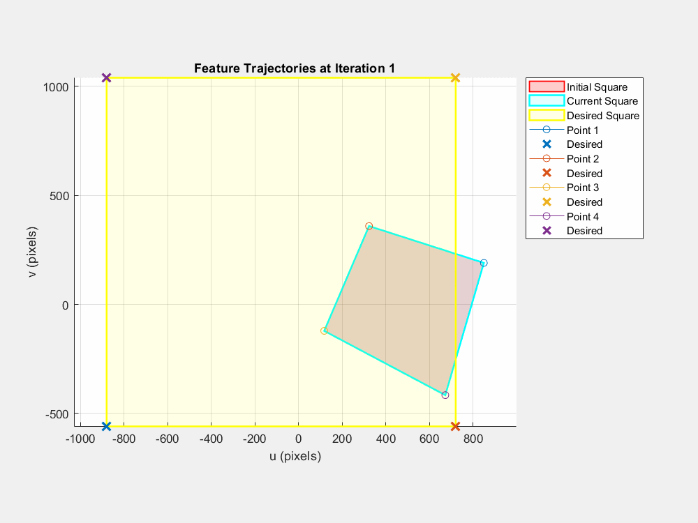

# Adaptive Switch Image-Based Visual Servoing - Implementation Study

**⚠️ Academic Implementation:** This is an educational reproduction of the method proposed by Ghasemi et al. (2020) as part of a graduate-level Vision-Based Control course project.

## 📋 Overview

This project implements and analyzes the **Adaptive Switch IBVS** controller originally proposed in:

> **Ghasemi, A., Li, P., & Xie, W.-F. (2020).** "Adaptive Switch Image-Based Visual Servoing for Industrial Robots." *International Journal of Control, Automation and Systems*, 18(5), 1324-1334.  
> DOI: [10.1007/s12555-019-0201-1](https://doi.org/10.1007/s12555-019-0201-1)

### 🎯 Project Goal

To **reproduce and validate** the theoretical framework presented in the original paper through MATLAB simulation, and to analyze its performance under various test scenarios.

## 🔬 Implementation Scope

### What This Project Contains:
- ✅ MATLAB implementation of the three-stage IBVS control strategy
- ✅ Simulation environment with UR5 robot model
- ✅ Comparative analysis: Traditional IBVS vs. Adaptive Switch IBVS
- ✅ Visualization of results and convergence behavior
- ✅ Educational documentation and analysis

## 🎓 Academic Context

**Course:** EE529 - Vision Based Control  
**Instructor:** Prof. Dr. Mustafa Ünel

**Project Type:** Term project - Implementation and analysis of published research method

## 📊 My Contributions

While implementing the published method, this project includes:

1. **Original MATLAB Code:** Complete implementation from scratch (not provided in original paper)
2. **Extended Test Cases:** Additional extreme scenarios (200°+ mismatches)
3. **Comparative Analysis:** Side-by-side comparison with traditional IBVS
4. **Comprehensive Visualization:** Feature trajectories, error norms, camera paths, joint angles
5. **Educational Documentation:** Detailed explanation of methodology and results

## ✨ Key Findings (Reproduction Results)

My implementation successfully validates the claims from the original paper:

| Test Case | Traditional IBVS | Adaptive Switch IBVS | Improvement |
|-----------|-----------------|----------------------|-------------|
| [30°, 30°, 30°] | 96 iterations | **70 iterations** | ✅ 27% faster |
| [10°, 30°, 60°] | 95 iterations | **63 iterations** | ✅ 34% faster |
| [10°, 15°, 200°] | ❌ Failed | **✅ 59 iterations** | Handles extreme cases |
| [200°, 110°, -130°] | ❌ Failed | **✅ 108 iterations** | Handles extreme cases |

## 🎬 Simulation Demonstrations

### Case 2: Moderate Orientation Mismatch [10°, 30°, 60°]

<table>
  <tr>
    <td><b>Traditional IBVS</b></td>
    <td><b>Adaptive Switch IBVS</b></td>
  </tr>
  <tr>
    <td>
      
      <br>
      <i>Converged in 95 iterations</i>
    </td>
    <td>
      
      <br>
      <i>Converged in 63 iterations - 34% faster</i>
    </td>
  </tr>
</table>

**Key Observations:**
- Traditional IBVS shows irregular feature trajectories
- Adaptive Switch IBVS demonstrates smooth, controlled motion
- Significant performance improvement with staged control approach

---

### Case 3: Extreme Orientation Mismatch [10°, 15°, 200°]

<p align="center">
  
  <br>
  <b>Adaptive Switch IBVS successfully handles extreme mismatches</b>
  <br>
  <i>Converged in 59 iterations - Traditional IBVS failed to converge</i>
</p>

**Critical Achievement:**
- ✅ Adaptive method handles 200°+ orientation mismatches
- ❌ Traditional IBVS fails completely in this scenario
- 🎯 Demonstrates robustness of the adaptive switching mechanism

---

### 📺 Full Presentation Video
[](https://youtu.be/-r2QnFF31to)

> 18-minute presentation covering methodology, implementation details, and results.

---


## 🛠️ Technical Implementation

### Technologies Used:
- MATLAB R2024b
- Robotics System Toolbox
- UR5 robot model (loadrobot)
- Custom visual servoing functions

### Core Components:
```matlab
% Main simulation function
AdaptiveSwitchIBVS()

% Three-stage control with adaptive switching
% Stage 1: Pure Rotation (α ≥ α₀)
% Stage 2: Pure Translation (α₁ ≤ α < α₀)  
% Stage 3: Full IBVS (α < α₁)
```

## 🚀 Usage
```matlab
% Clone the repository
git clone https://github.com/gizemdogafiliz/Adaptive-Switch-IBVS.git

% Navigate to directory
cd Adaptive-Switch-IBVS

% Run main simulation
AdaptiveSwitchIBVS()
```

For detailed results and plots, see the [project report](VisionBasedControl_Term_Project.pdf).

### Key Differences from Original Paper:
| Aspect | Original Paper | This Implementation |
|--------|---------------|---------------------|
| **Robot Platform** | Denso 6-DOF (real hardware) | UR5 (simulated in MATLAB) |
| **Control Type** | Torque-based dynamic control | Kinematic velocity control |
| **Camera Parameters** | Adaptive estimation included | Simplified (known parameters) |
| **Environment** | Real-world experiments | MATLAB simulation |
| **Purpose** | Novel research contribution | Educational reproduction |


## 📚 References & Credits

### Original Research:
1. **Ghasemi, A., Li, P., & Xie, W.-F. (2020).** "Adaptive Switch Image-Based Visual Servoing for Industrial Robots." *International Journal of Control, Automation and Systems*, 18(5), 1324-1334.

### Background Literature:
2. Chaumette, F., & Hutchinson, S. (2006). Visual servo control. I. Basic approaches. *IEEE Robotics & Automation Magazine*, 13(4), 82-90.
3. Chaumette, F., & Hutchinson, S. (2007). Visual servo control. II. Advanced approaches. *IEEE Robotics & Automation Magazine*, 14(1), 109-118.

## 🙏 Acknowledgments

- **Original Authors:** Ahmad Ghasemi, Pengcheng Li, and Wen-Fang Xie for their innovative research

- **Course Instructor:** Prof. Dr. Mustafa Ünel (Sabancı University)
